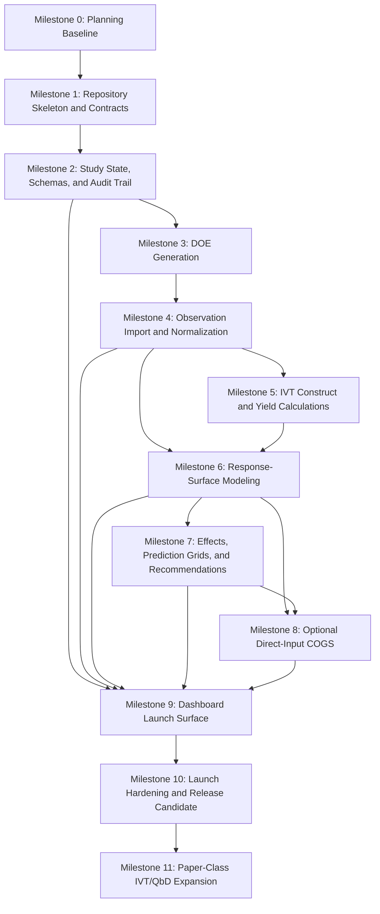

# Implementation Roadmap: Codex Scientific Toolchain

Date: 2026-04-20
Status: Draft for implementation planning
Related documents:

```text
- Technical Architecture Brief.md
- Product Requirements Document.md
- Scientific Methods Spec.md
- Data & Schema Contract.md
- MCP Tool API Spec.md
- IVT QbD Workflow Spec.md
- Dashboard UX Spec.md
- Validation & Test Plan.md
```

## 1. Purpose

This document defines the implementation sequence for the Codex Scientific Toolchain. It converts the planning documents into a buildable roadmap with milestones, workstreams, dependencies, acceptance gates, and release criteria.

The roadmap assumes the first implementation is a local Codex plugin with:

```text
- a Codex-facing skill workflow
- a Python MCP server for scientific computation
- JSON and CSV study artifacts
- a React dashboard for local preview
- deterministic validation fixtures
- no hosted data service at launch
```

## 2. Delivery Principles

Implementation must follow these principles:

```text
1. Build contracts before complex behavior.
2. Keep scientific calculations in the Python backend.
3. Keep the dashboard as a renderer of generated payloads.
4. Treat missing optional inputs as explicit unavailable states.
5. Make COGS available at launch but optional at runtime.
6. Ship narrow, validated vertical slices before broad feature coverage.
7. Add paper-class IVT/QbD depth through explicit milestones, not hidden scope creep.
8. Preserve reproducibility and auditability from the first commit.
```

The first release should prioritize a complete, testable workflow over advanced statistical breadth. A user must be able to create a study, generate a DOE, import observations, fit models, calculate theoretical and relative yield when construct data is supplied, optionally calculate direct-input cost efficiency, and review results in the dashboard.

## 3. Product Slices

### 3.1 Launch Slice

The launch slice includes:

```text
- plugin package skeleton
- Codex skill instructions
- local Python MCP server
- study artifact model
- factor and response schemas
- DOE generation
- endpoint and time-resolved import
- construct registration
- theoretical yield and relative yield
- OLS response-surface modeling
- effect summaries and prediction grids
- optional direct-input COGS
- recommendation and verification-plan scaffolding
- dashboard payload generation
- local React dashboard preview
- validation fixtures and test suite
```

### 3.2 Paper-Class Slice

The paper-class slice adds:

```text
- iterative D-optimal augmentation
- model-validity and lack-of-fit reporting with replicate-aware behavior
- design-space probability estimation
- verification-result comparison
- time-resolved response modeling
- construct-transfer modeling
- counterion DOE analysis
- multi-response desirability across yield, quality, relative yield, and optional cost efficiency
```

### 3.3 Later Integration Slice

Later integrations may include:

```text
- hosted MCP deployment
- authenticated multi-user studies
- ELN or LIMS import/export
- lab instrument data adapters
- richer statistical engines
- regulated validation package
```

These are not launch dependencies.

## 4. Workstreams

### 4.1 Plugin and Codex Workflow

Responsible surface:

```text
- plugins/doe-scientific-toolchain/.codex-plugin/plugin.json
- plugins/doe-scientific-toolchain/.mcp.json
- plugins/doe-scientific-toolchain/skills/scientific-study-designer/SKILL.md
- .agents/plugins/marketplace.json
- .codex/config.toml.example
- examples/prompts/
- user-facing workflow guidance
```

Primary responsibilities:

```text
- expose the plugin to Codex
- describe the correct tool-call sequence
- prevent Codex from inventing numerical results
- describe unavailable-state behavior
- document IVT/QbD workflow prompts
```

### 4.2 Python MCP Server

Responsible surface:

```text
- mcp-server/
- mcp-server/src/
- mcp-server/tests/
```

Primary responsibilities:

```text
- define MCP tools
- validate requests
- call scientific engine modules
- write artifacts
- write audit logs
- return structured summaries
```

### 4.3 Scientific Engine

Responsible surface:

```text
- mcp-server/src/doe_toolchain/science/
- mcp-server/src/doe_toolchain/ivt/
- mcp-server/src/doe_toolchain/economics/
```

Primary responsibilities:

```text
- DOE generation
- factor encoding
- model matrix construction
- OLS fitting
- diagnostics
- theoretical-yield calculation
- relative-yield calculation
- optional cost calculation
- recommendation scoring
- verification-plan logic
```

### 4.4 Data Contracts and Artifacts

Responsible surface:

```text
- schemas/
- fixtures/
- outputs/studies/
```

Primary responsibilities:

```text
- JSON schema definitions
- CSV metadata conventions
- artifact paths
- input and output hashes
- schema migration notes
- fixture data and golden outputs
```

### 4.5 Dashboard

Responsible surface:

```text
- apps/dashboard/
- apps/dashboard/src/
- apps/dashboard/tests/
```

Primary responsibilities:

```text
- render dashboard_payload.json
- display unavailable states
- display warnings
- distinguish observed, predicted, recommended, verification, and unavailable data
- support desktop, tablet, and mobile review
- avoid scientific recalculation in the browser
```

### 4.6 Validation and Release

Responsible surface:

```text
- scripts/
- mcp-server/tests/
- apps/dashboard/tests/
- validation-reports/
```

Primary responsibilities:

```text
- run quality commands
- validate schemas
- compare golden outputs
- run end-to-end fixtures
- capture dashboard screenshots
- produce release validation reports
```

## 5. Milestones

### 5.1 Milestone 0: Planning Baseline

Goal:

```text
Freeze the product, method, data, API, workflow, UX, validation, security, and setup planning baseline.
```

Deliverables:

```text
- Product Requirements Document.md
- Scientific Methods Spec.md
- Data & Schema Contract.md
- MCP Tool API Spec.md
- IVT QbD Workflow Spec.md
- Dashboard UX Spec.md
- Validation & Test Plan.md
- Implementation Roadmap.md
- Security & Provenance Plan.md
- Packaging & Setup Guide.md
- Canonical Build Contract.md
- Production Execution Plan.md
```

Acceptance criteria:

```text
- all documents exist
- all documents agree that COGS is optional at runtime
- all documents agree that direct user costs are required for cost efficiency
- all documents agree that the scientific backend is the numerical source of truth
- launch and paper-class scope are distinguishable
```

### 5.2 Milestone 1: Repository Skeleton and Contracts

Goal:

```text
Create the repository structure, package metadata, schema files, fixture directories, and empty-but-callable MCP tool surface.
```

Build tasks:

```text
1. Create plugin metadata.
2. Create Python package skeleton.
3. Create MCP server entrypoint.
4. Create dashboard app skeleton.
5. Create schema directory and initial schemas.
6. Create fixture directory families.
7. Create validation scripts.
8. Create dependency lockfiles.
9. Add package-version capture smoke test.
10. Add placeholder MCP launch tool registry.
11. Add Plugin/MCP smoke-test procedure.
12. Wire local test commands.
```

Required directories:

```text
.agents/plugins/
.codex/
plugins/doe-scientific-toolchain/.codex-plugin/
plugins/doe-scientific-toolchain/skills/scientific-study-designer/
mcp-server/src/doe_toolchain/
mcp-server/tests/
schemas/
fixtures/studies/
fixtures/dashboard/
apps/dashboard/
scripts/
outputs/studies/
validation-reports/
```

Minimum Gate 0 schemas:

```text
artifact_metadata.schema.json
warning.schema.json
error.schema.json
tool_envelope.schema.json
audit_log_entry.schema.json
study.schema.json
factor_space.schema.json
responses.schema.json
dashboard_payload.schema.json
```

Minimum Gate 0 fixtures:

```text
fixtures/studies/minimal_doe/
fixtures/studies/invalid_bad_study_id/
fixtures/studies/invalid_bad_factor_bounds/
fixtures/studies/invalid_duplicate_normalized_names/
fixtures/studies/invalid_missing_required_metadata/
fixtures/studies/invalid_units/
fixtures/dashboard/empty_payload_state.json
fixtures/dashboard/phase0_design_only_payload.json
fixtures/dashboard/payload_validation_error.json
```

Acceptance criteria:

```text
- plugin metadata validates
- MCP server starts locally
- launch tool names are registered
- schema validator runs
- dashboard app starts with fixture payload
- test commands execute with at least skeleton tests
- uv.lock and dashboard lockfile exist
- dependency version capture smoke test passes
- Codex can discover the local plugin, load scientific-study-designer, start MCP, and call create_or_update_study
```

Exit gate:

```text
Validation & Test Plan.md Gate 0 passes.
```

### 5.3 Milestone 2: Study State, Schemas, and Audit Trail

Goal:

```text
Make study artifacts durable, schema-valid, hashable, and auditable before scientific algorithms are added.
```

Build tasks:

```text
1. Implement study ID validation.
2. Implement artifact path resolver.
3. Implement safe write policy.
4. Implement schema validation helpers.
5. Implement input and output hashing.
6. Implement append-only audit log writer.
7. Implement study.json, factor_space.json, responses.json, and dashboard payload shell.
8. Add contract tests for create_or_update_study and validate_factor_space.
```

Acceptance criteria:

```text
- valid study creation writes expected artifacts
- invalid paths are rejected
- every tool call writes an audit event
- schema errors include precise paths
- hashes change when inputs change
- dashboard payload shell can be rendered by dashboard
```

Dependencies:

```text
- Milestone 1
```

### 5.4 Milestone 3: DOE Generation

Goal:

```text
Generate experiment matrices from validated factor spaces.
```

Build tasks:

```text
1. Implement continuous and categorical factor encoding.
2. Implement full factorial design.
3. Implement Latin hypercube design.
4. Implement candidate-set generation.
5. Implement D-optimal selection.
6. Implement launch augmentation foundation: iteration metadata, locked-row schema, and unavailable-state warnings.
7. Implement center point and replicate policy.
8. Write design artifacts and metadata.
9. Add DOE golden-output tests.
```

Acceptance criteria:

```text
- fixed seeds produce stable DOE outputs
- generated runs remain inside factor bounds
- hard constraints are respected
- rank-deficient model requests produce warnings
- D-optimal artifacts include candidate-set and selection metadata
- dashboard matrix can display planned runs and can represent augmentation metadata without requiring full iterative augmentation
```

Dependencies:

```text
- Milestone 2
```

### 5.5 Milestone 4: Observation Import and Normalization

Goal:

```text
Import endpoint and time-resolved experimental data without losing source fidelity.
```

Build tasks:

```text
1. Implement endpoint CSV and JSON import.
2. Implement time-resolved CSV and JSON import.
3. Validate run IDs against design artifacts.
4. Validate and normalize response units.
5. Preserve source row numbers and raw values.
6. Implement missing-value policy.
7. Implement replicate policy.
8. Add import fixtures for clean, missing, invalid, and sparse data.
```

Acceptance criteria:

```text
- clean endpoint data imports successfully
- clean time-resolved data imports successfully
- invalid run IDs fail in strict mode
- missing values produce warnings
- raw source files remain separate from derived artifacts
- dashboard can render observed endpoint and time-course data
```

Dependencies:

```text
- Milestone 3
```

### 5.6 Milestone 5: IVT Construct and Yield Calculations

Goal:

```text
Support IVT-specific construct registration, theoretical yield, and relative yield.
```

Build tasks:

```text
1. Implement construct schema.
2. Implement sequence validation.
3. Implement base composition.
4. Implement poly(A) metadata handling.
5. Implement limiting-nucleotide theoretical yield.
6. Implement relative yield.
7. Add IVT sequence fixtures.
8. Add dashboard relative-yield payload support.
```

Acceptance criteria:

```text
- valid constructs register successfully
- invalid sequence characters fail
- base counts match hand-calculated fixtures
- theoretical yield identifies limiting nucleotide
- relative yield is unavailable when required inputs are missing
- dashboard exposes assumptions and unavailable states
```

Dependencies:

```text
- Milestone 4
```

### 5.7 Milestone 6: Response-Surface Modeling

Goal:

```text
Fit deterministic regression models and produce diagnostics.
```

Build tasks:

```text
1. Implement model term specification.
2. Implement model matrix construction.
3. Implement OLS fitting.
4. Implement coefficient, standard-error, residual, and prediction outputs.
5. Implement R2, adjusted R2, RMSE, and cross-validation metric.
6. Implement rank-deficiency warnings.
7. Implement replicate-aware lack-of-fit availability.
8. Add model-fit golden tests.
```

Acceptance criteria:

```text
- coefficients match reference fixtures
- diagnostics match reference fixtures
- insufficient observations fail safely
- rank-deficient models warn explicitly
- model artifacts link to source observation and design artifacts
- dashboard diagnostics view renders model state and warnings
```

Dependencies:

```text
- Milestone 4
- Milestone 5 for relative-yield response workflows
```

### 5.8 Milestone 7: Effects, Prediction Grids, and Recommendations

Goal:

```text
Convert fitted models into interpretable effect summaries, contour grids, and next-experiment recommendations.
```

Build tasks:

```text
1. Implement effect extraction.
2. Implement Pareto-style effect ordering.
3. Implement prediction grid generation.
4. Implement quality-constraint classification.
5. Implement objective and desirability config.
6. Implement recommendation scoring.
7. Implement verification-run planning.
8. Add dashboard payload sections for effects, recommendations, and verification.
```

Acceptance criteria:

```text
- main effects, interactions, and square terms are labeled correctly
- prediction grids stay inside modeled factor ranges
- quality constraints classify points consistently
- recommendations include reason codes and caveats
- verification plans avoid duplicate observed runs unless replication is requested
- dashboard shows recommended and verification runs distinctly
```

Dependencies:

```text
- Milestone 6
```

### 5.9 Milestone 8: Optional Direct-Input COGS

Goal:

```text
Ship launch COGS scaffolding and product behavior without making cost inputs mandatory.
```

Build tasks:

```text
1. Implement cost table schema.
2. Implement component usage schema.
3. Implement direct-input cost validation.
4. Implement condition-level cost calculation.
5. Implement cost-efficiency calculation.
6. Implement economics unavailable state.
7. Add no-cost and with-cost workflow fixtures.
8. Add dashboard economics view.
```

Acceptance criteria:

```text
- no cost table produces economics unavailable
- missing costs do not block DOE, modeling, effects, recommendations, or dashboard
- direct cost inputs produce cost-efficiency outputs
- mixed currencies fail unless user supplies conversion data
- negative costs fail
- no external pricing is fetched or inferred
- dashboard shows cost provenance and skipped economics state
```

Dependencies:

```text
- Milestone 4
- Milestone 6
- Milestone 7 when cost efficiency is used in recommendations
```

### 5.10 Milestone 9: Dashboard Launch Surface

Goal:

```text
Provide a complete local review surface for launch workflows.
```

Build tasks:

```text
1. Implement dashboard payload reader.
2. Implement overview view.
3. Implement matrix view.
4. Implement time-course view.
5. Implement effects view.
6. Implement relative-yield view.
7. Implement economics view.
8. Implement recommendations view.
9. Implement verification view.
10. Implement diagnostics view.
11. Implement responsive layout and accessibility behavior.
12. Implement launch_dashboard_preview tool behavior.
```

Acceptance criteria:

```text
- dashboard renders launch payloads without scientific recalculation
- unavailable states are visible and specific
- warnings are visible where decisions are made
- desktop, tablet, and mobile smoke tests pass
- no critical console errors occur
- artifact metadata and audit references are accessible
```

Dependencies:

```text
- Milestone 2 for payload shell
- Milestone 4 for observations
- Milestone 6 for model diagnostics
- Milestone 7 for recommendations
- Milestone 8 for economics
```

### 5.11 Milestone 10: Launch Hardening and Release Candidate

Goal:

```text
Make the launch slice reliable enough to use on real local study data with clear limitations.
```

Build tasks:

```text
1. Complete launch fixture suite.
2. Run all launch unit tests.
3. Run all schema tests.
4. Run all MCP contract tests.
5. Run all dashboard tests.
6. Run end-to-end no-cost workflow.
7. Run end-to-end direct-cost workflow.
8. Run invalid-data workflow.
9. Produce validation report.
10. Update setup guide with tested commands.
```

Acceptance criteria:

```text
- Validation & Test Plan.md Gate 1 passes
- no Severity 0 or Severity 1 defects remain
- launch limitations are documented
- local setup works from clean checkout
- release package includes plugin metadata, skill instructions, server, dashboard, schemas, fixtures, and tests
```

Dependencies:

```text
- Milestones 1 through 9
```

### 5.12 Milestone 11: Paper-Class IVT/QbD Expansion

Goal:

```text
Enable the product to handle the class of design and analysis represented by the Sartorius/Boman IVT mRNA QbD paper.
```

Build tasks:

```text
1. Implement design-space probability estimation.
2. Implement verification-result comparison.
3. Implement full iterative D-optimal augmentation against locked existing runs.
4. Implement time-resolved response modeling.
5. Implement construct-transfer workflow.
6. Implement counterion DOE analysis.
7. Implement multi-response desirability across yield, dsRNA or quality response, relative yield, and optional cost efficiency.
8. Add paper-class fixtures.
9. Add dashboard design-space, construct-transfer, and counterion views.
10. Produce paper-class validation report.
```

Acceptance criteria:

```text
- Validation & Test Plan.md Gate 2 passes
- iterative D-optimal augmentation works
- endpoint and time-resolved IVT workflows pass
- design-space probability output is reproducible
- verification comparison is available
- construct transfer is available with explicit assumptions
- counterion DOE supports categorical counterion factors
- dashboard covers the full paper-class workflow
```

Dependencies:

```text
- Milestone 10
```

## 6. Dependency Graph



## 7. Implementation Order by Package

### 7.1 Backend Package Order

```text
1. config and paths
2. schemas and validation
3. audit logging
4. study service
5. factor and response models
6. DOE engine
7. observation importers
8. IVT construct utilities
9. theoretical and relative yield
10. model fitting
11. effects and prediction grids
12. economics
13. recommendations and verification planning
14. dashboard payload builder
15. paper-class analysis modules
```

### 7.2 Dashboard Package Order

```text
1. project scaffold
2. payload loading and validation
3. app shell and navigation
4. overview
5. matrix
6. warnings and diagnostics components
7. time courses
8. effects
9. relative yield
10. economics
11. recommendations
12. verification
13. design space
14. construct transfer
15. counterion
```

### 7.3 Test Package Order

```text
1. schema validation tests
2. path safety tests
3. audit log tests
4. DOE golden tests
5. import tests
6. IVT calculation tests
7. model-fitting tests
8. economics tests
9. recommendation tests
10. dashboard payload tests
11. end-to-end workflow tests
12. browser smoke tests
13. paper-class regression tests
```

## 8. Backlog

### 8.1 Launch Required

| ID | Work Item | Primary Workstream | Depends On | Acceptance Signal |
|---|---|---|---|---|
| L-001 | Plugin metadata and skill skeleton | Plugin | none | plugin metadata validates |
| L-002 | MCP server skeleton | Backend | L-001 | server starts and registers launch tools |
| L-003 | Dependency lock and version capture | Platform | L-002 | uv.lock, dashboard lockfile, and version smoke test pass |
| L-004 | Minimum Gate 0 schemas | Data | L-002 | required schema files exist |
| L-005 | Minimum Gate 0 fixtures | Data | L-004 | valid and invalid fixture files exist |
| L-006 | Schema validator | Data | L-004, L-005 | valid and invalid fixtures produce expected results |
| L-007 | Plugin/MCP smoke test | Platform | L-001, L-002 | Codex can call create_or_update_study |
| L-008 | Artifact path resolver | Backend | L-006 | path traversal tests fail safely |
| L-009 | Audit log writer | Backend | L-008 | every tool call writes audit event |
| L-010 | Study create/update tool | Backend | L-009 | study.json is schema-valid |
| L-011 | Factor and response schema | Data | L-006 | factor_space.json and responses.json validate |
| L-012 | DOE generation | Science | L-011 | fixed-seed design fixtures pass |
| L-013 | Observation import | Science | L-012 | endpoint and time-resolved import fixtures pass |
| L-014 | Construct registration | IVT | L-013 | valid construct fixture passes |
| L-015 | Theoretical and relative yield | IVT | L-014 | sequence fixtures pass |
| L-016 | OLS response-surface fitting | Science | L-013 | coefficient fixtures pass |
| L-017 | Effects and grids | Science | L-016 | effect fixtures pass |
| L-018 | Optional COGS | Economics | L-013 | no-cost and with-cost fixtures pass |
| L-019 | Recommendations | Science | L-017, L-018 | recommendations include reason codes |
| L-020 | Verification planning | Science | L-019 | verification plan fixture passes |
| L-021 | Dashboard payload generation | Backend | L-015, L-017, L-018, L-020 | payload schema validates |
| L-022 | Dashboard launch views | Dashboard | L-021 | browser smoke tests pass |
| L-023 | End-to-end launch tests | Validation | L-022 | no-cost and with-cost workflows pass |
| L-024 | Release validation report | Validation | L-023 | Gate 1 decision is recorded |

### 8.2 Paper-Class Required

| ID | Work Item | Primary Workstream | Depends On | Acceptance Signal |
|---|---|---|---|---|
| P-001 | Monte Carlo design-space probability | Science | L-016, L-017 | probability map fixture passes |
| P-002 | Verification-result comparison | Science | L-020 | comparison fixture passes |
| P-003 | Iterative D-optimal augmentation | Science | L-012, L-016 | locked-row augmentation fixture passes |
| P-004 | Time-resolved response modeling | Science | L-013, L-016 | trajectory model fixture passes |
| P-005 | Construct-transfer workflow | IVT | P-004, L-015 | transfer fixture passes |
| P-006 | Counterion DOE analysis | Science | L-016 | categorical counterion fixture passes |
| P-007 | Multi-response desirability | Science | L-018, P-001 | desirability fixture passes |
| P-008 | Paper-class dashboard views | Dashboard | P-001, P-002, P-005, P-006 | browser tests pass |
| P-009 | Paper-class validation report | Validation | P-008 | Gate 2 decision is recorded |

## 9. Definition of Done

### 9.1 Feature Definition of Done

A feature is done when:

```text
- API contract is implemented
- schema is implemented
- unit tests pass
- integration tests pass where relevant
- artifacts are written with hashes and method versions
- audit events are written
- dashboard payload includes the feature state
- unavailable and error states are tested
- documentation is updated
```

### 9.2 Scientific Feature Definition of Done

A scientific feature is done when:

```text
- method behavior is described in Scientific Methods Spec.md or an approved method note
- reference fixtures exist
- numerical tolerances are defined
- edge cases are tested
- warnings are machine-readable
- dashboard clearly marks assumptions and limitations
```

### 9.3 Dashboard Feature Definition of Done

A dashboard feature is done when:

```text
- it renders schema-valid payloads
- it rejects incompatible payloads
- it has loading, empty, error, warning, and unavailable states
- desktop, tablet, and mobile viewports pass smoke checks
- interactive controls have accessible names
- it does not calculate scientific outputs client-side
```

## 10. Risk Burn-Down

| Risk | Mitigation Milestone | Validation Signal |
|---|---|---|
| Codex invents calculations | Milestone 1 and 2 | skill instructions and MCP contracts require backend artifacts |
| schemas drift from tools | Milestone 2 | schema tests and payload contract tests pass |
| D-optimal implementation unstable | Milestone 3 | fixed-seed golden outputs pass |
| imported data loses provenance | Milestone 4 | source row and raw value preservation tests pass |
| IVT yield math is wrong | Milestone 5 | hand-calculated sequence fixtures pass |
| model diagnostics overstate quality | Milestone 6 | rank-deficiency and lack-of-fit tests pass |
| recommendations ignore constraints | Milestone 7 | constraint-respecting tests pass |
| COGS becomes hidden requirement | Milestone 8 | no-cost workflow passes end to end |
| dashboard misleads users | Milestone 9 | visual QA and status distinction tests pass |
| launch cannot be reproduced | Milestone 10 | validation report includes hashes, versions, and fixed-seed outputs |
| paper-class claim is premature | Milestone 11 | Gate 2 passes before claim is made |

## 11. Release Strategy

### 11.1 Internal Alpha

Purpose:

```text
Validate that local setup, MCP tool flow, and dashboard review work on synthetic fixtures.
```

Release criteria:

```text
- Milestones 1 through 6 complete
- no-cost launch workflow works through model fitting
- dashboard overview, matrix, and diagnostics render
- known limitations are documented
```

### 11.2 Launch Beta

Purpose:

```text
Validate the complete launch workflow with selected local study data.
```

Release criteria:

```text
- Milestones 1 through 10 complete
- Gate 1 passes
- optional direct-input COGS passes absent-cost and with-cost workflows
- all Severity 0 and Severity 1 defects are resolved
```

### 11.3 Paper-Class Beta

Purpose:

```text
Validate that the product can support the class of design and analysis represented by the reference IVT/QbD paper.
```

Release criteria:

```text
- Milestone 11 complete
- Gate 2 passes
- paper-class dashboard views render
- validation report includes construct-transfer, counterion, design-space, and verification comparison scenarios
```

## 12. Build Sequencing Rules

Implementation must follow these sequencing rules:

```text
- Do not build dashboard charts before the corresponding backend payload exists.
- Do not build recommendation UI before recommendations include reason codes and constraints.
- Do not build economics UI before no-cost and direct-cost backend states both exist.
- Do not ship cost efficiency until tests prove no external price inference occurs.
- Do not claim paper-class workflow support until Gate 2 passes.
- Do not treat a Codex explanation as a validation artifact.
```

## 13. Roadmap Summary

The implementation should proceed from contracts to computation to visualization:

```text
1. Establish plugin, MCP, schema, artifact, and audit foundations.
2. Build DOE generation and data import.
3. Add IVT construct/yield calculations and response-surface modeling.
4. Add effects, recommendations, verification planning, and optional COGS.
5. Build dashboard review surfaces from generated payloads.
6. Harden launch with validation reports.
7. Add paper-class IVT/QbD workflows after launch foundations are stable.
```

This sequence minimizes the chance of producing persuasive but unaudited scientific output.
